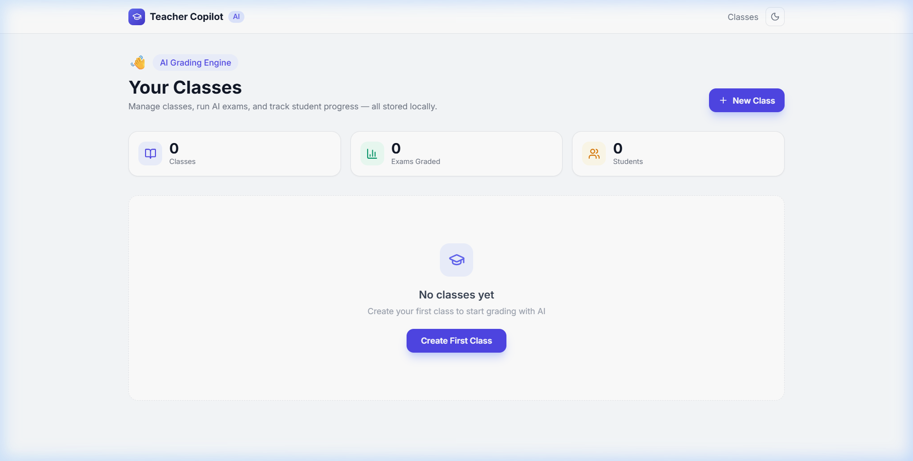
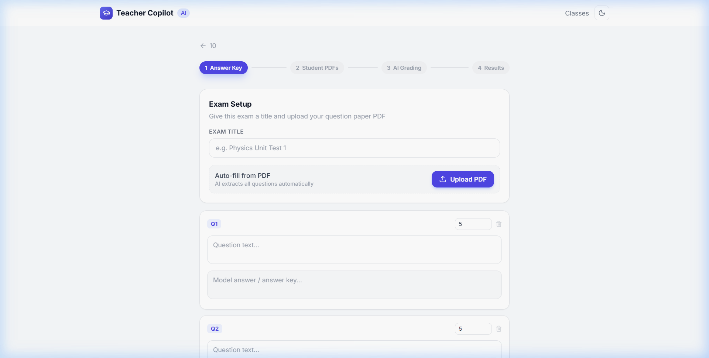
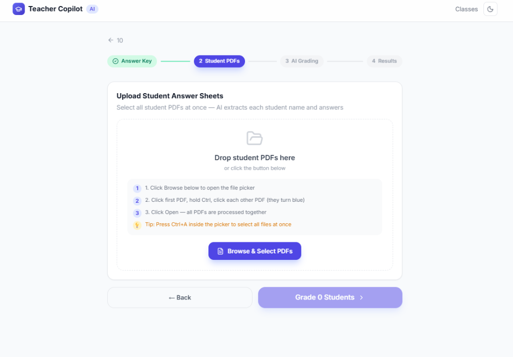
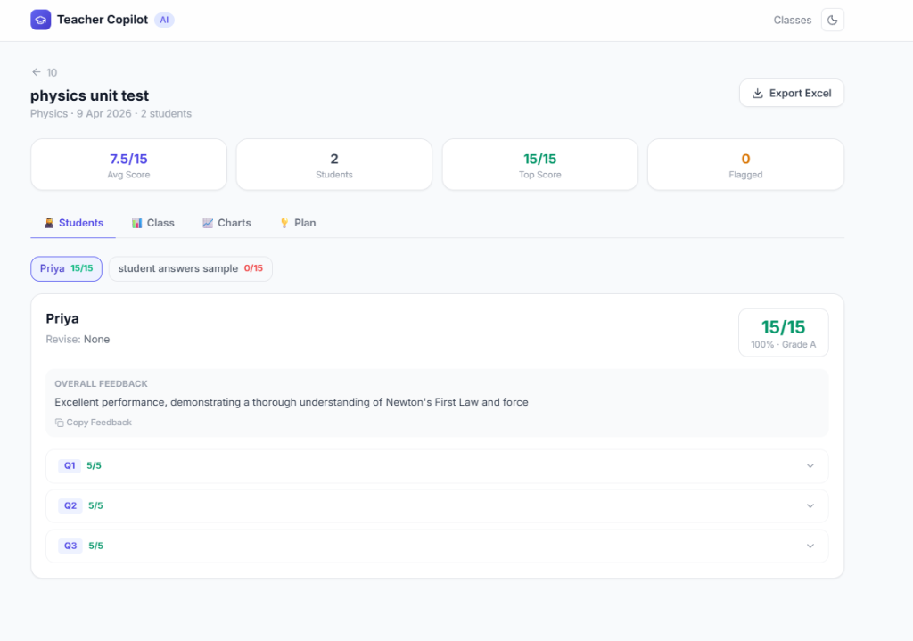
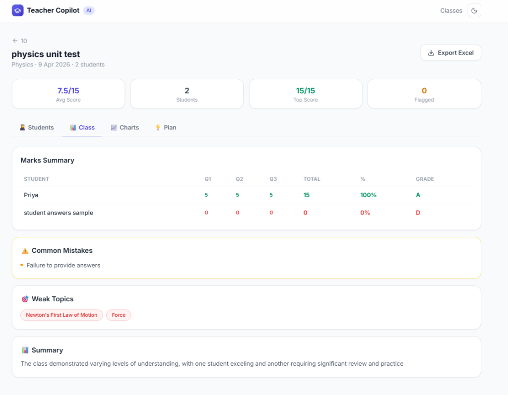

<div align="center">

# 🎓 Teacher Copilot

### AI-Powered Exam Grading Platform for Teachers

[](https://teacher-copilot-eight.vercel.app/)
[](https://nextjs.org/)
[](https://typescriptlang.org/)
[](https://vercel.com/)

> Upload your question paper PDF → upload student answer PDFs → get AI-generated grades, feedback, and class analytics in seconds.

</div>

---

## 📸 Screenshots

<table>
  <tr>
    <td align="center"><b>🏠 Dashboard</b></td>
    <td align="center"><b>📄 Exam Setup + PDF Auto-fill</b></td>
  </tr>
  <tr>
    <td></td>
    <td></td>
  </tr>
  <tr>
    <td align="center"><b>📂 Upload Student PDFs</b></td>
    <td align="center"><b>✅ AI Grading Results</b></td>
  </tr>
  <tr>
    <td></td>
    <td></td>
  </tr>
  <tr>
    <td align="center" colspan="2"><b>📊 Class Analytics</b></td>
  </tr>
  <tr>
    <td colspan="2" align="center"></td>
  </tr>
</table>

---

## ✨ Features

| Feature | Description |
|---|---|
| 📄 **PDF Auto-fill** | Upload question paper PDF — AI extracts all questions & answers instantly |
| 👩‍🎓 **Bulk Student Grading** | Upload all student PDFs at once; AI grades every answer individually |
| 🤖 **Per-Question AI Feedback** | Strength, mistake, and detailed feedback for every question per student |
| 📊 **Class Analytics** | Marks summary table, common mistakes, weak topics & class summary |
| 📈 **Visual Charts** | Score bar charts, per-question averages, grade distribution donut chart |
| 🏆 **Student Profiles** | Progress over time, revision topics, full exam history |
| ✏️ **Manual Override** | Override any AI mark with a custom score + reason |
| 🚩 **Plagiarism Detection** | Automatically flags students with suspiciously similar answers |
| 📥 **Excel Export** | One-click export of all results to `.xlsx` |
| 🌙 **Dark / Light Mode** | Toggle theme with a single click |
| 💾 **100% Local Storage** | All data stays in your browser — no server, no database, full privacy |

---

## 🚀 Live Demo

**[👉 teacher-copilot-eight.vercel.app](https://teacher-copilot-eight.vercel.app/)**

---

## 🏗️ Tech Stack

| Technology | Role |
|---|---|
| **Next.js 14** (App Router) | React framework |
| **TypeScript** | Type-safe development |
| **Tailwind CSS** | Styling |
| **Groq AI (LLaMA 3)** | AI grading engine & question extraction |
| **pdfjs-dist** | Client-side PDF text extraction |
| **Recharts** | Charts & data visualization |
| **XLSX (SheetJS)** | Excel report export |
| **Vercel** | Deployment & hosting |

---

## 📂 Project Structure

```
teacher-copilot/
├── app/
│   ├── page.tsx                  # 🏠 Home — Class list
│   ├── classes/[id]/page.tsx     # 📚 Class detail & exam history
│   ├── exam/
│   │   ├── new/page.tsx          # ✍️  Create exam (4-step wizard)
│   │   └── [id]/page.tsx         # 📊 Exam results & analytics
│   └── students/[id]/page.tsx    # 👤 Student profile & progress
├── lib/
│   ├── ai.ts                     # 🤖 Groq AI integration
│   ├── pdfParser.ts              # 📄 Client-side PDF parsing
│   ├── storage.ts                # 💾 localStorage CRUD helpers
│   ├── excelExport.ts            # 📥 Excel export logic
│   ├── types.ts                  # 📝 TypeScript interfaces
│   └── utils.ts                  # 🔧 Helper functions
├── components/
│   ├── Navbar.tsx
│   └── ThemeToggle.tsx
└── public/
    ├── pdf.min.mjs               # pdfjs browser build (served statically)
    └── pdf.worker.min.mjs        # pdfjs worker (served statically)
```

---

## 🔄 How It Works

```
Teacher creates a class
         ↓
Step 1 ── Upload question paper PDF
          AI extracts: questions + model answers
         ↓
Step 2 ── Upload student answer PDFs (bulk)
          AI reads each student's written answers
         ↓
Step 3 ── AI grades each answer vs model answer
          • Marks awarded per question
          • Strength & mistake identified
          • Overall feedback generated
          • Plagiarism flagged if detected
         ↓
Step 4 ── Full results dashboard
          • Student tab: per-student breakdown
          • Class tab: marks table + insights
          • Charts tab: visual analytics
          • Plan tab: teaching suggestions
          • Export to Excel
```

---

## ⚙️ Local Setup

### Prerequisites
- Node.js 18+
- A free [Groq API key](https://console.groq.com/)

### Installation

```bash
# 1. Clone the repository
git clone https://github.com/akhilpratapsingh-dev/teacher-copilot.git
cd teacher-copilot

# 2. Install dependencies
npm install

# 3. Create your environment file
# Create a file named .env.local with these contents:
GROQ_API_KEY=your_groq_api_key_here
NEXT_PUBLIC_GROQ_API_KEY=your_groq_api_key_here

# 4. Start the development server
npm run dev
```

Open **[http://localhost:3000](http://localhost:3000)** in your browser.

---

## 🌍 Deploy Your Own

1. **Fork** this repository on GitHub
2. Go to **[vercel.com/new](https://vercel.com/new)** → Import your fork
3. Add **Environment Variables** in Vercel:

| Key | Value |
|---|---|
| `GROQ_API_KEY` | Your Groq API key |
| `NEXT_PUBLIC_GROQ_API_KEY` | Your Groq API key |

4. Click **Deploy** — done! ✅

Get your free API key at **[console.groq.com](https://console.groq.com)**

---

## 🛠️ Development Commands

```bash
npm run dev      # Start development server (http://localhost:3000)
npm run build    # Build production bundle
npm run lint     # Run ESLint checks
```

---

## 👨‍💻 Author

**Akhil Pratap Singh**

[](https://github.com/akhilpratapsingh-dev)

---

## 📄 License

MIT License — feel free to use, modify, and distribute.

---

<div align="center">

⭐ **If this project helped you, please give it a star!** ⭐

</div>
